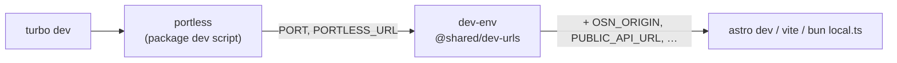

# Devloop URLs

Every dev server in this repo runs behind [portless](https://github.com/vercel-labs/portless). Each app answers on a named HTTPS host instead of a port number, and each git worktree gets its own complete stack.

Each package's `dev` script is `portless`. It reads that package's own `"portless"` key (name + script) and runs its real command — `dev:app` — behind the proxy.

## Setup

Once per machine. It binds port 443, adds a local CA to the system trust store and writes an `/etc/hosts` block, so it asks for sudo:

```bash
bunx portless proxy start        # or: bunx portless service install (starts at boot)
bunx portless doctor             # proxy, routes, DNS, CA trust
bunx portless clean              # undo it all: state, CA trust entry, hosts block
```

> [!warning] That CA is a machine-level change
> A trusted root CA can sign a certificate for any host the machine talks to, production dashboards included. `portless` is therefore pinned with a tilde (`~0.15.5`), not a caret — it is pre-1.0, and a version bump is a change to review rather than a lockfile refresh. Nothing installs or starts it for you: the package has no lifecycle scripts, and the proxy refuses to start without a TTY or under `CI`. `portless clean` reverses the whole footprint.

## The names

| Package | URL |
| --- | --- |
| `@osn/social` | `https://musubi.localhost` |
| `@osn/api` | `https://id.musubi.localhost` |
| `@osn/landing` | `https://www.musubi.localhost` |
| `@pulse/web` | `https://pulse.localhost` |
| `@pulse/api` | `https://api.pulse.localhost` |
| `@pulse/landing` | `https://www.pulse.localhost` |
| `@cire/landing` | `https://cire.localhost` |
| `@cire/invites` | `https://invite.cire.localhost` |
| `@cire/host` | `https://host.cire.localhost` |
| `@cire/vendor` | `https://vendor.cire.localhost` |
| `@cire/api` | `https://api.cire.localhost` |
| `@zap/api` | `https://zap.cire.localhost` |
| `@tools/lab` | `https://lab.localhost` |

The names mirror production hostnames — `id.musubi` for `id.musubi.social`, `host.cire` for `host.cireweddings.com`. `@tools/lab` is the exception: the component lab has no production host, so it is simply `lab`.

> [!important] The nesting is load-bearing
> A WebAuthn RP ID must be the origin's host or a registrable suffix of it, and a passkey created under one RP ID is invisible under another. `@osn/social` creates the passkey; `@osn/api` verifies it. Both sit under a shared `musubi` parent so `musubi.localhost` can serve as the RP ID for both. Flat names — `musubi` beside `osn-api` — would put every local passkey out of reach of the API that checks it. See [[passkey-primary]].

## One stack per worktree

In a linked worktree portless prepends the branch name as a subdomain, so the same `bun run dev` in two worktrees gives two complete, independent stacks:

```
main worktree        https://host.cire.localhost
feat/rsvp-sheet      https://rsvp-sheet.host.cire.localhost
```

Nothing collides, and no worktree has to wait for another to give up a port. The `main` worktree keeps the bare names — portless skips the prefix on default branch names.

## Why sibling origins are derived, not configured

Because that branch prefix exists, no app can be told where its siblings live from a committed `.env`: the answer differs per worktree.

`@shared/dev-urls` derives it instead. Its `dev-env` launcher fronts each `dev:app`, reads the app's own `PORTLESS_URL`, splits off the shared prefix and TLD, and rebuilds every sibling's origin from them. It then exports the same environment variables the deployed tiers set — `OSN_ISSUER_URL`, `OSN_RP_ID`, `OSN_ORIGIN`, `OSN_CORS_ORIGIN`, `DEV_LOGIN_RETURN_ORIGINS`, `WEB_ORIGIN`, `CIRE_API_ORIGIN`, `PULSE_CORS_ORIGIN`, `PUBLIC_API_URL`, `VITE_API_URL` and the rest.



No app source knows portless exists; every app keeps reading the variables it already read. Those values win over `.env`, because under portless a `localhost:4321` origin names a host nothing is listening on.

## Adding an app

Three places, all of which must agree:

1. The `"portless"` key in that package's `package.json` — the name the proxy registers, and `"script": "dev:app"`.
2. `DEV_APPS` in `shared/dev-urls/src/index.ts` — the same name, plus the port the app falls back to without portless.
3. `DEV_ENV` in `shared/dev-urls/src/app-env.ts` — which sibling URLs that app needs, keyed by the env var it already reads. An app that needs none still gets an entry returning `{}` — `@tools/lab` is the one — because the map has to cover every `DEV_APPS` key, and an entry it can forget is one an app can forget too.

## What the proxy costs

Measured 2026-08-21 on this machine, page load timed in headless Chrome from `Page.navigate` to `Page.loadEventFired`, fresh browser profile each time.

| App | Load | Through the proxy | Direct | Cost |
| --- | --- | --- | --- | --- |
| `@pulse/web` | steady state (median of 5) | 186 ms | 148 ms | +38 ms |
| `@osn/social` | steady state (median of 5) | 274 ms | 259 ms | +15 ms |
| `@pulse/web` | first load after a cold start | ~2.9 s | ~0.87 s | **+2 s** |
| `@osn/social` | first load after a cold start | 569 ms | 262 ms | +307 ms |

Steady state costs a small, roughly constant amount — the TLS handshake and the extra hop. Nothing to think about.

The **first** load after a cold start is the one to know about: on `@pulse/web` it is about three times slower through the proxy. Under HTTP/2 the browser's six-connections-per-origin limit disappears, so a cold Vite start fires its whole unbundled module graph at a single-threaded dev server at once, through one proxy event loop shared with every other app in the devloop. The multiplexing that helps a warm load hurts a cold one.

> [!tip] If you are iterating on cold starts
> `PORTLESS=0 bun run dev` takes the proxy out of the path entirely, which is the fastest cold loop and a fair baseline to measure against. The cold-start figures above are three clean samples per app-mode, each the first navigation after a fresh boot with `node_modules/.vite` cleared.

## Running without the proxy

```bash
PORTLESS=0 bun run dev                # whole devloop on the old fixed ports
bun run --cwd cire/host dev:app       # one app, no proxy at all
```

`PORTLESS` is in `globalPassThroughEnv` in `turbo.json`. Turbo 2 runs strict env
mode, which hands each task only the variables it is told to, so without that
line `PORTLESS=0` is stripped between the shell and the `dev` script and every
app comes up behind the proxy anyway. Pass-through, not `globalEnv`: the value
picks a devloop, it does not change any build output, and hashing it would evict
the whole cache every time someone toggled it.

The ports the frontends lost from their `dev` scripts moved into `astro.config.mjs` / `vite.config.ts` as `devPort(<old port>)`. Portless assigns a port and passes it as `PORT`; without portless the literal keeps the four Astro apps from all landing on 4321.

> [!warning] Agents: Astro backgrounds itself
> Astro 7 detects an agent environment and puts `astro dev` in the background. Control returns to portless, portless deregisters the route as soon as its child exits, and the URL 404s while a stray daemon still holds the port. Run `CLAUDECODE= bun run dev` to keep it in the foreground, and clear a stray with `bunx astro dev stop`. A human terminal is unaffected.

Related: [[commands]], [[monorepo-structure]], [[contributing]].
