# Auth Flow Failure Runbook

## Symptoms

- 401 / 400 responses from `/login/passkey/*`, `/login/recovery/complete`, `/register/*`, `/token`, or `/passkey/register/*`
- Users cannot register or sign in
- Step-up actions (`/recovery/generate`, `/account/email/*`, `/account/security-events/ack*`, `DELETE /passkeys/:id`) returning 401 or 400
- 429 spike on the `osn.auth.rate_limited` metric
- "Sign out everywhere else" appearing to fail silently
- Organiser (or any `@osn/client` consumer) reports **logged out on page reload** after a recent sign-in — see §4

## Auth surface (cheat sheet)

Primary login is **passkey-only**. OTP and magic link are step-up / verification factors only — they no longer mint a primary session. See [[passkey-primary]].

| Flow | Endpoints |
|---|---|
| Register | `POST /register/{begin,complete}` → mandatory `POST /passkey/register/{begin,complete}` |
| Login (passkey) | `POST /login/passkey/{begin,complete}` (identifier-bound or discoverable) |
| Login (recovery) | `POST /login/recovery/complete` |
| Refresh | `POST /token` (HttpOnly cookie only — body fallback removed) |
| Step-up | `POST /step-up/{passkey,otp}/{begin,complete}` |

## Diagnosis flow

```mermaid
flowchart TD
  start([Auth failing]) --> rl{HTTP 429?}
  rl -- yes --> ratelimited[See &#91;&#91;rate-limit-incident&#93;&#93;]
  rl -- no --> origin{Origin header rejected?<br/>S-M1 guard}
  origin -- yes --> originfix[Allowlist the calling origin<br/>or check the cookie path]
  origin -- no --> flow{Which flow?}
  flow -- "/login/passkey" --> passkey[Step 1: Passkey checks]
  flow -- "/login/recovery" --> recovery[Step 2: Recovery checks]
  flow -- "/register" --> register[Step 3: Registration checks]
  flow -- "/token" --> refresh[Step 4: Refresh checks]
  flow -- "/step-up" --> stepup[Step 5: Step-up checks]
```



## 1. Passkey login

| Symptom | Likely cause | Action |
|---|---|---|
| `400 invalid_request` on `/login/passkey/complete` | Challenge expired or never persisted | Call `/begin` again. Check that the request does not hit the unknown-identifier branch (S-M1 enumeration safety returns synthetic options) |
| `400` on Tauri webview | Platform does not support WebAuthn | Give the user the FIDO2 / cross-device fallback or the recovery-code path |
| Repeated 401 on first ceremony after enrollment | Counter mismatch / signing key replaced | Inspect `passkeys` table, confirm the `credentialId` registered matches the one being asserted |
| `400 invalid_request` for known-good identifier | Account has 0 passkeys (legacy / corrupt) | Recover the account with recovery-code login. Then enroll a passkey again |

Discoverable login (no `identifier`) returns identical-shape options for unknown and known accounts, so nobody can probe the namespace — see the "Enumeration safety (S-M1)" section in [[passkey-primary]].

## 2. Recovery-code login

| Symptom | Likely cause | Action |
|---|---|---|
| `400 invalid_request` for valid-looking code | Code already consumed, or wrong identifier | Codes are single-use. Check `recovery_codes.used_at`. The failure surface is uniform by design (S-M2 timing parity) |
| `429` after a few attempts | 5/hour/IP cap (recoveryComplete) | Wait the window or unblock at the proxy |
| Login succeeds but other devices stay signed in | Expected | Recovery login revokes all sessions in the same transaction (`security_invalidation{trigger=recovery_code_consume}`) — only the new session survives |

## 3. Registration

| Symptom | Likely cause | Action |
|---|---|---|
| `/register/complete` succeeds but UI refuses to dismiss | `/passkey/register/complete` did not run | This is by design — the account-level invariant is "≥1 passkey at all times". Send the user back into the registration flow |
| `/passkey/register/begin` returns 401 with `step_up_required` | Account already has ≥1 passkey (S-H1) | Caller must present a fresh `X-Step-Up-Token` (passkey or otp amr) — bootstrap path is only for the very first passkey |
| `409 handle_taken` on `/register/begin` | Handle namespace clash with users **or** organisations | Prompt for a new handle |

## 4. Refresh / `/token`

| Symptom | Likely cause | Action |
|---|---|---|
| 401 with `missing_refresh_token` | Cookie not sent | Confirm the client uses `credentials: "include"`. The cookie name is `__Host-osn_session` (non-local) or `osn_session` (local). We removed the body fallback on purpose (S-M1) |
| 401 with `family_revoked` | Reuse detection (C2) tripped | An old/leaked refresh token replayed; the entire family is revoked. The user must sign in again |
| 401 with `expired` on a token <30 days old | Sliding window not extending | Check the rotated-session store metric `osn.auth.session.rotated_store.operations{result=error}` — a Redis outage degrades reuse detection but should not block valid tokens |
| Access token rejected with `aud_mismatch` | Token issued by a different audience | Verify the caller is using the JWKS at `/.well-known/jwks.json` and asserting `aud: "osn-access"` (S-M2) |
| **Client logged out on every reload** (>5 min after sign-in) | The client treats the stale cached access token as the source of truth and never reads the refresh cookie | Client-side bug, not server. `@osn/client` `loadSession` must rehydrate from the cookie when the cached access token is expired but `hasSession === true` (see [[identity-model]] "Session load on mount"). Confirm `POST /token` fires on reload with `credentials: "include"`. Fixed in `feat/organiser-session-refresh`. |
| Reload logout only under load / on first request to a cold isolate | Single `/token` with no retry; a transient `5xx`/`429`/network blip read as logged-out | `fetchTokenGrant` now retries transient failures with bounded backoff and only treats a **4xx `invalid_grant`** as terminal. Check `/token` 5xx/429 rates if it recurs. |

## 5. Step-up

| Symptom | Likely cause | Action |
|---|---|---|
| `step_up_required` on `/recovery/generate`, `/account/email/complete`, `/account/security-events/ack*`, `DELETE /passkeys/:id` | Token missing or wrong amr | Mint a token with `POST /step-up/{passkey,otp}/{begin,complete}`. Check the route's `allowedAmr` config |
| Token rejected with `replay` | `jti` already consumed (`StepUpJtiStore`) | Mint a fresh token — they're single-use |
| Token rejected with `aud_mismatch` | Cross-used as access token (or vice versa) | Step-up JWTs carry `aud: "osn-step-up"` |
| Repeated `replay` errors after a short Redis outage | Fail-closed design — an outage blocks step-up | Restore Redis. Watch `osn.auth.step_up.verified{result}` |

## Useful queries

### Decode a JWT payload

```bash
echo "<token-payload-section>" | base64 -d | jq .
```

### Inspect a user's passkeys

```sql
SELECT id, label, last_used_at, backup_eligible, backup_state
FROM passkeys WHERE account_id = '<acc_…>';
```

### Inspect security events surfaced to the user

```sql
SELECT id, kind, created_at, acknowledged_at
FROM security_events WHERE account_id = '<acc_…>' ORDER BY created_at DESC LIMIT 50;
```

## Related

- [[passkey-primary]] — primary login contract (the only primary factor)
- [[recovery-codes]] — recovery-code generation, consumption, and audit
- [[step-up]] — sudo token model and allowed AMR config
- [[sessions]] — server-side sessions, rotation, reuse detection
- [[rate-limiting]] — current limits and 429 diagnosis
- [[arc-tokens]] — S2S auth (not user auth — included for contrast)
