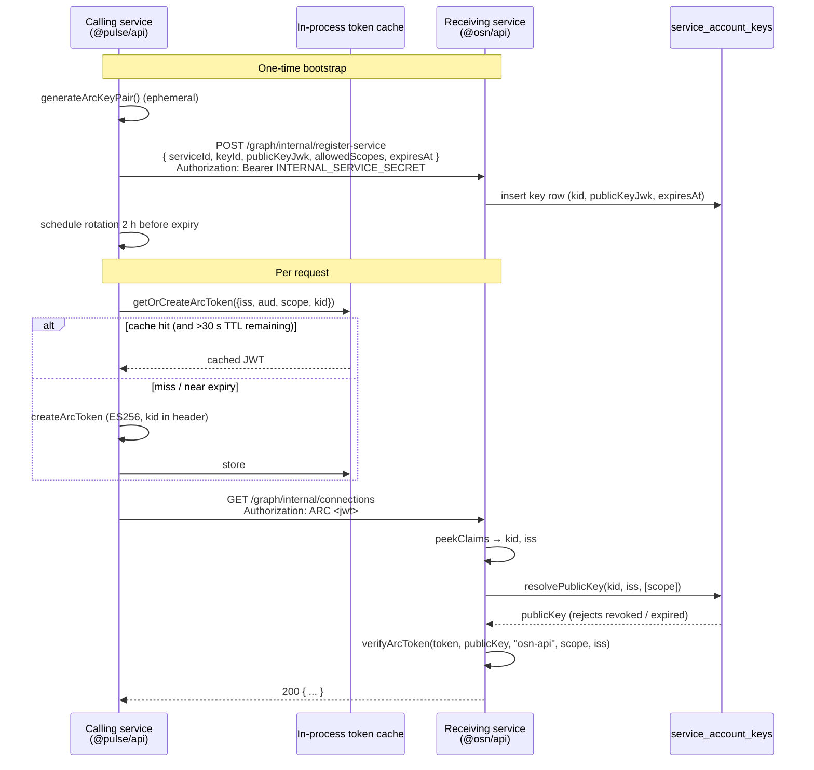

# ARC Tokens (S2S Auth)

ARC is OSN's service-to-service authentication token — an ASAP-style self-issued JWT for backend-to-backend calls (e.g. `@pulse/api` querying `@osn/api`'s social graph).

## Token issuance + verification flow



## Key Properties

- **ES256 (ECDSA P-256)** -- compact, fast, no shared secret
- **Self-issued:** each service signs its own token with its private key
- **Short-lived (5 min TTL);** cached in-memory, re-issued 30s before expiry
- **Scope-gated:** `scope` claim limits what the token can do. Scope format is `/^[a-z0-9_:-]+$/` — hyphens are valid and load-bearing (`step-up:verify`, `app-enrollment:write`, `graph:resolve-account`); until 2026-07-05 the signer's `SCOPE_PATTERN` wrongly rejected `-`, breaking every Flow B leave-app token mint (S-H arc-scope-pattern, see [[changelog/security-fixes]]). The scope taxonomy is the server-side `PERMITTED_SCOPES` allowlist in `osn/api/src/routes/graph-internal.ts`: `graph:read` (general internal-graph reads), `graph:resolve-account` (profileId → accountId only — least privilege on the multi-account invariant, granted to pulse-api + cire-api), `account:erase`, `step-up:verify`, `app-enrollment:write`
- **Audience-scoped:** `aud` claim names the target service (e.g. `"osn-core"`)
- **`kid`-keyed:** JWT protected header carries `kid` (key ID UUID); receiver looks up the specific key row, not just the issuer
- **Public key discovery:** first-party services have rows in `service_accounts` (allowed scopes) + `service_account_keys` (key material per `kid`); third-party apps use JWKS URL derived from `iss`
- **Automatic rotation:** ephemeral keys are rotated before expiry via `startKeyRotation()` — no manual key management required

## Location

Lives in `shared/crypto` (`@shared/crypto`). Import from `@shared/crypto`.

The pure ES256 key/JWK helpers (`importKeyFromJwk`, `generateArcKeyPair`,
`exportKeyToJwk`, `thumbprintKid`, `ArcTokenError`) live in a **DB-free**
`src/jwk.ts`, exposed as the `@shared/crypto/jwk` subpath. The barrel
(`@shared/crypto`) re-exports them, so normal consumers import as before.
**Cloudflare Workers consumers must import from `@shared/crypto/jwk`, not the
barrel** — the barrel pulls `arc.ts → @osn/db → @shared/db-utils → bun:sqlite`
(the DB-backed `resolvePublicKey` path), which cannot bundle for workerd.
`@shared/osn-auth-client`'s JWKS-verification path does exactly this.

## Exports

```typescript
generateArcKeyPair()                                           // → CryptoKeyPair (ES256)
exportKeyToJwk(key)                                            // → JSON string (for DB storage)
importKeyFromJwk(jwk)                                          // → CryptoKey
createArcToken(privateKey, { iss, aud, scope, kid }, ttl?)              // → signed JWT string; kid in header
verifyArcToken(token, publicKey, expectedAud, scope?, expectedIssuer?)  // → ArcTokenPayload or throws
resolvePublicKey(kid, issuer, tokenScopes?)                            // → Effect<CryptoKey, ArcTokenError, Db>
getOrCreateArcToken(privateKey, { iss, aud, scope, kid }, ttl?)         // → cached JWT (cache key: kid:iss:aud:canonical(scope):ttl)
clearTokenCache() / clearPublicKeyCache()                      // → for testing / key rotation
evictPublicKeyCacheEntry(kid)                                  // → immediate per-key cache eviction (call on revoke)
evictExpiredTokens()                                           // → force-sweep expired tokens (no debounce)
```

## When to Use ARC Tokens

| Scenario | Use ARC? | Why |
|----------|----------|-----|
| `@pulse/api` -> `@osn/api` graph | **Yes** | HTTP call to `/graph/internal/*` must prove caller identity |
| Third-party app -> any OSN endpoint | **Yes** | Caller has no shared secret; presents its public key via JWKS |
| User-facing API call | No | Use user JWT (Bearer access token); ARC is machine-to-machine only |
| Background job -> `@osn/api` | **Yes** | Job acts as a service, not a user |

## Calling Service (Token Issuer) — Typical Pattern

```typescript
import { getOrCreateArcToken, generateArcKeyPair, exportKeyToJwk } from "@shared/crypto";

// Boot-time: either load pre-distributed private key or generate ephemeral pair
// See pulse/api/src/services/graphBridge.ts for the Promise-singleton pattern.
const pair = await generateArcKeyPair();
// Register public key with @osn/api using INTERNAL_SERVICE_SECRET...

// Per-request: get a cached or fresh token
const token = await getOrCreateArcToken(pair.privateKey, {
  iss: "pulse-api",      // this service's service_id
  aud: "osn-api",        // target service
  scope: "graph:read",   // minimal required scope
});

// Attach to outgoing HTTP request
fetch("http://localhost:4000/graph/internal/connections", {
  headers: { Authorization: `ARC ${token}` },
});
```

## Receiving Service (Token Verifier) -- Typical Pattern

```typescript
import { verifyArcToken, resolvePublicKey } from "@shared/crypto";
import { Effect } from "effect";

// In an Elysia route guard or middleware (canonical: osn/api/src/lib/arc-middleware.ts):
const arcMiddleware = (requiredScope: string) => async (ctx) => {
  const auth = ctx.headers.authorization;
  if (!auth?.startsWith("ARC ")) return ctx.set.status = 401;

  const token = auth.slice(4);
  // resolvePublicKey looks up the kid + issuer and validates allowed_scopes
  const publicKey = await Effect.runPromise(
    resolvePublicKey(kid, iss, [requiredScope]).pipe(Effect.provide(DbLive))
  );
  // Pass the resolved issuer as expectedIssuer (X1) so jose enforces the
  // signed `iss` matches the kid's registered service.
  const claims = await verifyArcToken(token, publicKey, "osn-api", requiredScope, iss);
  // claims.iss, claims.aud, claims.scope are now verified
};
```

## Key Storage Schema

Two DB tables cooperate:

| Table | Columns | Purpose |
|-------|---------|---------|
| `service_accounts` | `service_id PK`, `allowed_scopes`, timestamps | Maps issuer ID → allowed scope list |
| `service_account_keys` | `key_id PK`, `service_id FK`, `public_key_jwk`, `registered_at`, `expires_at`, `revoked_at` | Per-key material; multiple rows per service during rotation |

`resolvePublicKey(kid, issuer, scopes?)` joins both tables, rejects expired (`expires_at < now`) and revoked (`revoked_at IS NOT NULL`) keys. Key cache keyed by `kid`.

## Service Registration

Ephemeral key auto-rotation is the only supported strategy. Pre-distributed stable keys are not used.

### Startup self-registration with auto-rotation

`osn/api` exposes `POST /graph/internal/register-service`, protected by a shared `INTERNAL_SERVICE_SECRET` Bearer token. On startup, `startKeyRotation()` in `pulse/api`:

1. Generates an ephemeral P-256 key pair with a UUID `keyId`
2. Exports the public key (`exportKeyToJwk(pair.publicKey)`)
3. POSTs `{ serviceId, keyId, publicKeyJwk, allowedScopes, expiresAt }` to the endpoint
4. Schedules rotation `KEY_ROTATION_BUFFER_HOURS` (default 2h) before expiry
5. On rotation: registers the new key BEFORE swapping the signing singleton — zero downtime

Behaviour when `INTERNAL_SERVICE_SECRET` is unset:

- **Non-local env** (`OSN_ENV != "local"`): throws at startup so misconfiguration is caught immediately rather than failing silently on the first S2S call.
- **Local dev** (`OSN_ENV` unset or `"local"`): registration is skipped, a warning is logged, and the server still boots. Any S2S call to `osn/api` will fail until the secret is configured — useful for unrelated local work that doesn't need the social graph bridge.

Behaviour when `osn/api` is unreachable (`ConnectionRefused`, DNS failure, etc):

- **Non-local env**: throws at startup and the process exits. Deployment ordering is expected to guarantee `osn/api` is up first; a race here signals a real misconfiguration.
- **Local dev**: a warning is logged, `startKeyRotation()` returns `"pending-retry"`, and a background retry is scheduled with exponential backoff (5 s, 10 s, 20 s… capped at 5 min) plus ±1 s symmetric jitter until registration succeeds. Lets `bun run dev:pulse` boot both services in parallel without a crash when `pulse-api` wins the startup race. The retry classifier uses an explicit allowlist of Bun/Node network-error codes (`ConnectionRefused`, `ECONNREFUSED`, `ECONNRESET`, `ENOTFOUND`, `ETIMEDOUT`, `EAI_AGAIN`, `EHOSTUNREACH`, `ENETUNREACH`, `UND_ERR_CONNECT_TIMEOUT`, `UND_ERR_SOCKET`) — HTTP 4xx/5xx responses and any other error still throw and exit. The retry reuses the same ephemeral key across attempts; this is safe because `/register-service` upserts both `service_accounts` (by `serviceId`) and `service_account_keys` (by `keyId`) via `ON CONFLICT DO UPDATE`, so repeated POSTs are idempotent.

Env vars: `INTERNAL_SERVICE_SECRET`, `KEY_TTL_HOURS` (default 24), `KEY_ROTATION_BUFFER_HOURS` (default 2).

```bash
# Both env files need:
INTERNAL_SERVICE_SECRET=<shared-random-string>
```

### osn-api as issuer — outbound key registration (deletion fan-out)

The flow above has `pulse-api` / `zap-api` registering **with** osn-api. The
reverse also holds: when osn-api fans out a full-account erasure it acts as the
ARC **issuer**, POSTing `/internal/account-deleted` to Pulse + Zap with
`scope: account:erase`. Because those downstreams verify against a
**pre-registered** key (Pulse's `arc-middleware.ts` looks the `kid` up in an
in-memory registry seeded by `POST /internal/register-service`; there is **no**
JWKS-by-kid pull), osn-api must first publish *its own* outbound ARC public key
to each downstream — otherwise the first `/internal/account-deleted` POST is
401'd and the GDPR Art. 17 erasure stalls.

- **Bun path** (`local.ts`): `startOutboundKeyRotation()` in
  `osn/api/src/lib/outbound-arc.ts` registers with Pulse + Zap at boot and
  self-reschedules rotation via an unref'd `setTimeout`.
- **Workers path** (`osn/api/src/index.ts` `scheduled`): a workerd isolate has
  no boot hook, so `registerOutboundKeysOnce()` runs inside the cron
  `scheduled` handler, **before** the fan-out sweeps, registering once per
  isolate (a module-level latch suppresses re-POSTing on later ticks; the
  downstream upsert makes a repeat harmless anyway). A registration failure is
  logged via `Effect.logError` and swallowed so a transient downstream outage
  never aborts the sweeps — the next tick retries (the latch only flips on full
  success). The lazy key init in `outbound-arc.ts` only *mints* the keypair; it
  does **not** publish the public key, so this explicit registration is required.

### Key revocation

`DELETE /graph/internal/service-keys/:keyId` (also protected by `INTERNAL_SERVICE_SECRET`) sets `revoked_at` in the DB AND evicts the in-process public key cache entry immediately — revocation takes effect on the next request with no wait for the 5-minute cache TTL (S-H100).

`/register-service` validates requested `allowedScopes` against a server-side allowlist (`PERMITTED_SCOPES`). Any unknown scope returns 400 — a service cannot self-promote its scope set (S-M101).

> ⚠ **Scope authorisation is service-granular, not key-granular (S-H1, 2026-07-05).**
> `allowedScopes` lives on `service_accounts` (one row per serviceId) and every
> `/register-service` call **replaces** it wholesale, while keys live per-`kid` in
> `service_account_keys`. Consequences: (a) a service that registers multiple keys
> (pulse-api registers a graph-bridge key AND a leave-app key) **must send the
> identical scope union from every registration call site**, or the registrations
> clobber each other on boot races / rotations and randomly fail-close S2S calls;
> (b) per-key least privilege between a service's own keys does not exist — any of
> its keys can mint any scope in the service union. The per-key `allowed_scopes`
> schema fix is tracked in [[TODO]] as S-M1 (arc-key-scopes). Keep
> `pulse/api/src/services/graphBridge.ts` `REGISTERED_SCOPES` and
> `pulse/api/src/lib/outbound-arc.ts` `ALLOWED_SCOPES` in lockstep.

### Cross-process revocation window (X4)

Revocation is immediate *in the process that performs it* (it calls `evictPublicKeyCacheEntry(kid)`). Other processes that have already cached the key keep serving it until their own `publicKeyCache` entry expires — at most one cache TTL.

- TTL defaults to **300 s** and is overridable via the `ARC_PUBLIC_KEY_CACHE_TTL_SECONDS` env var (kept finite; a lower value shrinks the window at the cost of more DB lookups).
- So the **worst-case cross-process revocation latency is ≤ the configured TTL (≤5 min by default)**. The DB row is updated synchronously, so a process with a cold/expired cache rejects the revoked key immediately — only warm caches on *other* nodes lag.
- A Redis pub/sub fan-out that evicts `(kid)` across all processes on revoke (closing this window to ~0) is backlogged in `wiki/TODO.md`.

## Issuer binding (X1)

`verifyArcToken` accepts an optional `expectedIssuer`. When supplied, jose enforces that the signed `iss` claim equals it. The OSN ARC middleware (`requireArc`) passes the issuer it resolved the key for (`peeked.iss`), so the signed `iss` is **cryptographically** bound to the `kid`→issuer DB mapping, not just checked via the DB lookup. A token whose signed `iss` differs from the service its `kid` is registered under is rejected at verification.

Pulse's in-memory ARC receiver (`pulse/api/src/lib/arc-middleware.ts`) also passes the registered issuer as `expectedIssuer`; its pre-existing explicit `payload.iss !== registered.issuer` check is retained as defence-in-depth and can be dropped one release later.

`expectedIssuer` is **optional** for backward compatibility — omitting it leaves `iss` unenforced (existing crypto-level behaviour).

## Token cache key (X3)

The in-process token cache key is `kid:iss:aud:canonical(scope):ttl`:

- **`ttl` is part of the key** — a token requested with a shorter TTL never reuses a longer-lived cached entry whose remaining life exceeds the caller's intent.
- **scope is canonicalised** with the same normalisation (`normaliseScopes` in `@shared/crypto/jwk`) the signer applies (trim + lowercase + drop empties), so formatting-only differences (`" Graph:Read "` vs `"graph:read"`) hit the same entry as the signed token.
- **scope is NOT sorted** — `"graph:read,graph:write"` and `"graph:write,graph:read"` stay distinct cache entries, matching the distinct `scope` claims `signArcToken` signs (it preserves order). Sorting would be a safe, trivial collapse but would also reorder the signed claim, so it's left as a deliberate non-change.

## Current S2S Strategy

`@pulse/api` calls `@osn/api`'s `/graph/internal/*` endpoints over HTTP, authenticated with ARC tokens. ARC token verification middleware (`requireArc` in `osn/api/src/lib/arc-middleware.ts`) protects all inbound calls. The [[s2s-patterns|graphBridge]] in `pulse/api` is the only file that makes these calls.

## Security Notes

- **S-C2 (fixed):** Untrusted ARC `iss` claim was used as a metric label before verification. Fixed with `safeIssuer()` runtime guard in `arc-metrics.ts`.
- **S-H100 (fixed):** Revocation now evicts `publicKeyCache` immediately via `evictPublicKeyCacheEntry(kid)` — no 5-minute window.
- **S-H101 (fixed):** `INTERNAL_SERVICE_SECRET` comparison uses `crypto.timingSafeEqual` — no timing oracle.
- **S-M100 (fixed):** `peekClaims` uses base64url decode (RFC 7515 §2) — `-` and `_` in UUID `kid`s are handled correctly.
- **S-M101 (fixed):** `/register-service` validates `allowedScopes` against `PERMITTED_SCOPES` allowlist — services cannot self-promote.
- **S-M102 (fixed):** `resolvePublicKey` cache hit stores `allowedScopes` and validates scopes on every hit — no bypass when `tokenScopes` is omitted.
- ARC tokens are machine-to-machine only. Never use them for user-facing authentication (use user JWTs for that).
- The `Authorization: ARC ...` header is the trust boundary for inbound trace context propagation -- only ARC-authenticated callers have their `traceparent` honoured.

## Metrics

ARC token metrics live in `shared/crypto/src/arc-metrics.ts`:
- `arc.token.issued` — counter by issuer/audience
- `arc.token.verification` — counter by result (ok, expired, bad_signature, unknown_issuer, revoked_key, scope_denied, audience_mismatch, malformed)
- All issuer/audience values pass through `safeIssuer()` to prevent cardinality explosion
- `verifyArcToken` self-reports its outcomes; receiver middlewares whose early-exit branches reject **before** `verifyArcToken` runs must record the counter themselves. Pulse's `requireArc` does (S-L6, 2026-07-05): missing/malformed token → `malformed`, kid not in registry → `unknown_issuer`, kid revoked or registration expired → `revoked_key`, registry scope denial → `scope_denied`. No double-count — paths that reach `verifyArcToken` are only counted there.

## Source Files

- [shared/crypto/src/arc.ts](../../shared/crypto/src/arc.ts) — ARC token implementation (`kid`, `resolvePublicKey`, rotation cache)
- [shared/crypto/src/arc-metrics.ts](../../shared/crypto/src/arc-metrics.ts) — ARC metrics
- [osn/api/src/lib/arc-middleware.ts](../../osn/api/src/lib/arc-middleware.ts) — `requireArc` Elysia middleware (reads `kid` from header)
- [osn/api/src/routes/graph-internal.ts](../../osn/api/src/routes/graph-internal.ts) — internal graph routes + `/register-service` + `/service-keys/:keyId` (revoke)
- [osn/db/src/schema/index.ts](../../osn/db/src/schema/index.ts) — `service_accounts` + `service_account_keys` table definitions
- [pulse/api/src/services/graphBridge.ts](../../pulse/api/src/services/graphBridge.ts) — `startKeyRotation()`, ephemeral key auto-rotation
- [CLAUDE.md](../../CLAUDE.md) — "ARC Tokens (S2S Auth)" section
