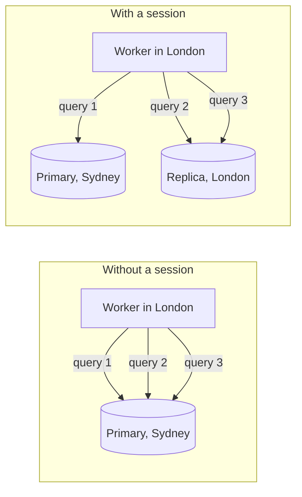

# D1 Read Replication and the Sessions API

A D1 database has one **primary**, in one region, and every query goes to it
unless the request opts into a **session**. cire's primary is in Oceania, so a
guest opening an invite from London pays a round trip to Sydney *for each query
the request makes*. Read replication puts read-only copies in other regions;
the [Sessions API](https://developers.cloudflare.com/d1/best-practices/read-replication/)
is how a Worker actually uses them without giving up read-your-writes.

## The cost being paid

Measured 2026-08-31 from a Sydney client against the OC-primary `cire-db`, by
diffing a route that runs one extra `SELECT` against a route that runs none:

| Measure | Value |
|---|---|
| Control (no D1 query) | 15.0 ms |
| One extra `SELECT` | 50.7 ms |
| **Cost of one query** | **35.7 ms** (p10 33.0, p90 39.3, n=25) |

That is the *near* case. The same query from Europe or North America pays the
transoceanic round trip on top, and a request that reads four tables pays it
four times. Folding queries together — the work in #849, #852 — cuts N. Sessions
cut the distance instead: the first query goes to the primary, and every later
query in the same session can be served by any replica caught up to the
bookmark the first one returned.



## How a session is threaded through the Worker

`D1Database.withSession(constraint)` returns a `D1DatabaseSession` exposing
`prepare`, `batch` and `getBookmark()` — and `prepare` + `batch` are *exactly*
the two methods Drizzle's D1 driver ever calls, so a session can stand in for a
database.

The problem is where to put it. `@cire/api` builds its whole Elysia app graph
**once per isolate** (`aot: false`, ~50 route factories closing over one Drizzle
handle), so a per-request handle cannot be threaded explicitly through the
routes. The seam is `cire/api/src/db/d1-session.ts`:

| Piece | Lifetime | Job |
|---|---|---|
| `createSessionRoutedClient(binding)` | One per isolate | A stable `{ prepare, batch }` the Drizzle handle is built over. Each call delegates to whichever session is current. |
| `withD1Session(session, body)` | One per request | Puts a session on an `AsyncLocalStorage` for the duration of `body`. |
| `runInD1Session(d1, body)` | One per request | Opens a fresh session and does the above. Called in `fetch`, wrapping the entire dispatch, and once around each of the six `scheduled` sweeps. |

`node:async_hooks` is available because the Worker sets `nodejs_compat`.

> [!important] Losing the context is safe; crossing it would not be
> With no session on the context the shim falls through to the raw binding —
> every query goes to the primary, which is exactly the behaviour before this
> existed. So a handler that somehow escapes the async context costs latency,
> never correctness.
>
> The dangerous case is the opposite one: two concurrent requests seeing each
> other's session, so request A's read is served by a replica pinned to B's
> older bookmark. Every service query runs through `dbQuery` →
> `Effect.promise` → Effect's fiber scheduler, which batches work from all live
> fibers into shared microtask flushes — precisely where an async-context
> mechanism could cross stores. `d1-session.test.ts` asserts it does not, with
> two interleaved requests run through the real scheduler.

## The constraint: always `first-primary`

`withSession()` takes `"first-primary"` or `"first-unconstrained"`.

| Constraint | First query | What you get |
|---|---|---|
| `first-primary` | Primary | The request observes every write committed before it started. |
| `first-unconstrained` | Anywhere | One more round trip saved; the request may not see a write that has already committed. |

cire uses `first-primary` Worker-wide. `routes/invite.ts` deliberately serves a
`no-store`, edit-sensitive payload so an organiser's edit shows up when a guest
revalidates the invite — `first-unconstrained` would reintroduce exactly the
staleness that header exists to prevent. One constraint for the whole Worker
keeps that property from depending on which route a request happened to reach.

## Turning replication on

Adopting the Sessions API is **inert until the database has replicas**: with
none, a session behaves exactly as before. So the code ships first and the
switch is flipped afterwards, separately and reversibly.

There is no `wrangler` subcommand as of wrangler 4.x — it is the dashboard
(D1 → database → Settings → Read replication) or the REST API:

```bash
curl -X PUT \
  "https://api.cloudflare.com/client/v4/accounts/$CF_ACCOUNT_ID/d1/database/$DB_ID" \
  -H "Authorization: Bearer $CF_API_TOKEN" \
  -H "Content-Type: application/json" \
  -d '{"read_replication":{"mode":"auto"}}'
```

`mode: "auto"` lets Cloudflare place and manage replicas; `"disabled"` turns it
back off. Replicas are read-only and asynchronous — a write always goes to the
primary, and replication lag is what the bookmark protects a session from.

> [!note] Cost
> Cloudflare's docs are explicit that you "incur the exact same D1 usage billing
> with or without replicas, based on `rows_read` and `rows_written`" — so
> replication changes latency, not the row-count ceilings in
> [[free-tier-limits]]. What those docs do *not* state either way is whether the
> feature is available on the free plan; confirm that in the dashboard before
> counting on it.

## Rules

- **Never `first-unconstrained`.** See above. If a route ever genuinely wants
  it, it needs its own session and its own argument in writing, not a change to
  the Worker-wide constant.
- **One session per unit of work, established at the entry point.** One per
  request in `fetch`, one per sweep in `scheduled`. Not per route, not per
  service — a session opened deeper down starts its own bookmark chain and
  re-pays the first-query trip to the primary.
- **Anything that queries after the response is sent must be created inside the
  session scope.** `ctx.waitUntil(p)` only registers `p`; what matters is where
  `p` was created. Each `scheduled` sweep is wrapped for this reason — one
  session per sweep, not one shared by all six, so six unrelated delete-heavy
  sweeps do not keep advancing a single bookmark that then forwards every read
  to the primary anyway.
- **Build the Drizzle handle over the shim, never over `env.DB` directly** —
  a handle over the raw binding silently opts every query it serves out of
  replication, with no error to notice.

## History

| Date | Change |
|---|---|
| 2026-08-31 | Measured the per-query cost from Sydney: 35.7 ms against the OC primary. |
| 2026-09-01 | `@cire/api` adopts the Sessions API — `db/d1-session.ts`, one session per `fetch` and per `scheduled` sweep, `first-primary`. Ships inert. |
