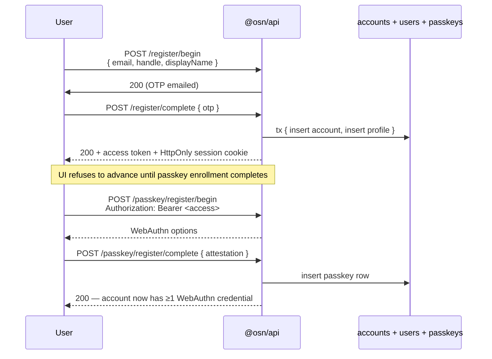

# Identity Model

## Terminology

| Term | Meaning | Code entity |
|------|---------|-------------|
| **User** | The actual human person. Not a data structure — never a type name, column, or variable. | — |
| **Account** | Login identity — email, passkeys, auth tokens. A user owns one account. | `accounts` table, `acc_` prefix |
| **Profile** | Public-facing identity — handle, display name, avatar. An account can have multiple profiles. | `users` table (legacy name), `Profile` type, `usr_` prefix |
| **Organisation** | Group identity composed of profiles. | `organisations` table, `org_` prefix |

A user owns an account, which owns one or more profiles. The relationship is: **User (person) → Account (login) → Profiles (public identities)**.

OSN uses a two-tier identity model inspired by Meta's Accounts Center. A single **account** (the login entity) can own multiple **profiles** (the public-facing handles). **Organisations** are separate entities composed of individual profiles.

## Architecture

```mermaid
flowchart TD
  user(["User<br/>(real human)"])
  account["accounts<br/>acc_xxxx · email · passkeyUserId<br/><i>login identity — never exposed</i>"]
  profileA["users (profile)<br/>usr_aaaa · handle: @alice<br/><i>public identity</i>"]
  profileB["users (profile)<br/>usr_bbbb · handle: @alice_work<br/><i>public identity</i>"]
  graph["social graph<br/>connections · blocks"]
  pulse["pulse/*<br/>events · RSVPs"]
  zap["zap/*<br/>chats · messages"]

  user -.owns.-> account
  account -- "1:N (private link)" --> profileA
  account -- "1:N (private link)" --> profileB
  profileA --> graph
  profileA --> pulse
  profileA --> zap
  profileB --> graph
  profileB --> pulse
  profileB --> zap
```

Key invariant: every cross-domain reference (RSVP, chat membership, connection edge) keys on `profileId`. `accountId` never leaves the auth boundary — see Privacy Rules below.

## Accounts

The `accounts` table is the **authentication principal** — the entity that logs in, owns passkeys, and receives step-up / email-change OTPs.

| Column | Type | Notes |
|--------|------|-------|
| `id` | `text PK` | `acc_` prefix + 12 hex chars |
| `email` | `text UNIQUE` | Login credential — the only place email lives |
| `passkeyUserId` | `text NOT NULL UNIQUE` | Random UUID used as WebAuthn `user.id` — opaque, non-correlating (P6) |
| `maxProfiles` | `integer` | Default 5; enforced by `createProfile` in P3 |
| `createdAt` | `timestamp` | |
| `updatedAt` | `timestamp` | |

**Key invariants:**
- `accountId` is **never exposed** in any API response, token claim, or log entry. It is the multi-account correlation identifier — leaking it reveals which profiles belong to the same person. Added to the log redaction deny-list in P6.
- `passkeyUserId` is a random UUID generated at account creation, used as the WebAuthn `user.id` in passkey registration. It stops anyone correlating two profiles on the same account through matching WebAuthn credential `user.id` fields. Lazy-filled for accounts created before P6.
- Email is **only on accounts**, not duplicated on profiles.
- Passkeys reference `accounts.id` (not profile IDs), because authentication is account-level.

## Profiles (DB table: `users`)

The `users` table is the **public-facing identity**. This is what other profiles see — a handle, display name, and avatar. Every reference across Pulse, Zap, and the social graph points to `users.id` (the `profileId`). Code-level functions and API parameters use `profile` terminology (e.g. `findProfileByHandle`, `registerProfile`, `blockProfile`); the DB table retains the name `users` for migration stability.

| Column | Type | Notes |
|--------|------|-------|
| `id` | `text PK` | `usr_` prefix + 12 hex chars |
| `accountId` | `text FK → accounts.id` | The owning login entity (never exposed) |
| `handle` | `text UNIQUE` | `@handle` — immutable social identity |
| `displayName` | `text` | Nullable display name |
| `avatarUrl` | `text` | Nullable avatar URL |
| `isDefault` | `boolean` | Exactly one per account; auto-selected on login |
| `createdAt` | `timestamp` | |
| `updatedAt` | `timestamp` | |

**Key invariants:**
- `profileId` (previously `userId`) is the canonical identifier throughout all services. Pulse events, Zap chats, RSVPs, connections, blocks — everything keys on `profileId`. All service functions, route parameters, and error messages use "profile" terminology (not "user").
- Each profile has a **fully independent social graph**. If profile A blocks someone, profile B (same account) is NOT affected.
- Two profiles from the same account **can interact** — they can connect, message, RSVP to the same event. Preventing this would reveal the account link.
- Handle namespace is **shared with organisations** — no user handle can collide with an org handle.

## Organisations

Organisations are independent entities that are **composed of profiles, not accounts**. An org member is a handle/profile. The system cannot distinguish whether two members in the same org share an account.

| Column | Type | Notes |
|--------|------|-------|
| `id` | `text PK` | `org_` prefix |
| `handle` | `text UNIQUE` | Shared namespace with user handles |
| `name` | `text` | Display name |
| `ownerId` | `text FK → users.id` | A profile, not an account |

### Organisation Members

| Column | Type | Notes |
|--------|------|-------|
| `id` | `text PK` | `orgm_` prefix |
| `organisationId` | `text FK → organisations.id` | |
| `profileId` | `text FK → users.id` | The member's profile |
| `role` | `admin \| member` | |

**Key invariants:**
- Multiple profiles from the same account **can be in the same org** — one might be admin, another a member. This is by design.
- Org ownership is per-profile. Deleting a profile that owns an org requires ownership transfer first (enforced in P3).
- The `listMembers` service return **never includes `accountId`** — defence in depth against correlation leakage.

## Token Model

| Token | Bound to | Format | TTL | Purpose |
|-------|----------|--------|-----|---------|
| Access | Profile | ES256 JWT (`sub` = profileId) | **5 min** | Authorise API calls as a specific profile |
| Session (refresh) | Account | Opaque `ses_` + 40 hex chars (160-bit entropy) | 30 days (sliding) | Re-issue access tokens; enables profile switching without re-authentication |
| Enrollment | Account | ES256 JWT (`sub` = accountId) | 5 min | Passkey registration after signup |
| Recovery code | Account | 16 hex chars `xxxx-xxxx-xxxx-xxxx` (64-bit entropy) | No expiry, single-use | Lost-device account recovery (Copenhagen Book M2) — see [[recovery-codes]] |

Access tokens live in `localStorage` and are the only auth secret there after C3. A 5-minute TTL caps the XSS blast radius — the companion change is client `authFetch` silent-refresh on 401 via the HttpOnly refresh cookie. Third-party OAuth clients receive `expires_in: 300` in the `/token` response.

**Issuer pinning (O1).** Access and step-up JWTs are signed with `iss = AuthConfig.issuerUrl` and every verify pins `issuer` with a **30s `clockTolerance`** (`signJwt` / `verifyJwt` in `osn/api/src/services/auth/helpers.ts`). A token minted by a different OSN deployment is rejected. The downstream `@shared/osn-auth-client` verifier carries the same contract (W7) — rollout is **verifier-first**: the tolerant verifier must deploy before the signer enforces `iss`, or every legacy iss-less token would be rejected the instant the signer rolls out.

### Server-side sessions (Copenhagen Book C1)

Session tokens (formerly "refresh tokens") are **opaque** — not JWTs. The server stores only the **SHA-256 hash** of each token in the `sessions` table. A database leak does not expose valid tokens because the tokens have 160 bits of entropy.

**Sliding-window expiry:** when less than half the TTL remains (< 15 days), the session's `expiresAt` is extended by the full TTL from now. This matches the Copenhagen Book's recommended pattern.

**Revocation:** `invalidateSession(token)` deletes a single session row; `invalidateAccountSessions(accountId)` deletes all sessions for an account (used for security events). `POST /logout` exposes single-session invalidation.

**Sessions table:**

| Column | Type | Notes |
|--------|------|-------|
| `id` | `text PK` | SHA-256(raw token), hex-encoded |
| `account_id` | `text FK → accounts.id` | The owning account |
| `expires_at` | `integer` | Unix seconds |
| `created_at` | `integer` | Unix seconds |

Two profile management endpoints:
- `POST /profiles/switch` — present the session token + target `profileId` in the request body; receive a new access token for that profile. Per-account rate limited (20 switches/hr).
- `POST /profiles/list` — present the session token in the request body; receive all profiles for the account. Session tokens are never sent via `Authorization` headers to avoid conflation with access tokens.

## Client Storage Model (P4)

`@osn/client` stores the multi-profile session under a single `localStorage` key:

| Key | Shape | Purpose |
|-----|-------|---------|
| `@osn/client:account_session` | `AccountSession` JSON | Refresh token, active profile ID, per-profile access tokens, scopes, ID token |

The `AccountSession` structure:

```typescript
interface AccountSession {
  refreshToken: string;           // Account-scoped (shared across profiles)
  activeProfileId: string;        // Currently active profile
  profileTokens: Record<string, ProfileToken>;  // Per-profile access tokens
  scopes: string[];
  idToken: string | null;
}
```

**Design decisions:**
- Single-key storage (not multi-key) avoids the need for `keys()` enumeration on logout and simplifies atomic writes.
- Expired profile tokens are pruned on every `saveAccountSession` call (except the active profile's token, which is kept for identity tracking).
- An in-memory cache avoids redundant `localStorage.getItem` + `JSON.parse` round-trips within the same service instance.
- All storage reads are validated against Effect Schema (`decodeAccountSession`) — malformed data is discarded rather than consumed.
- Legacy sessions (pre-P4, stored under `@osn/client:session`) are migrated transparently on the first `getSession()` call.

## Session load on mount — durable refresh across reloads

`@osn/client` exposes `loadSession()` (the entry point the SolidJS `AuthProvider` calls on mount via the `session` resource). Because the access token has a **5-minute TTL** and lives only in memory, the `AccountSession` JSON persisted in `localStorage` almost always carries a **stale access token after a page reload**. The HttpOnly `__Host-osn_session` refresh cookie (30-day sliding window) is what actually keeps the organiser signed in; `loadSession` must consult it rather than trust the cached access token alone.

`loadSession` resolves three cases, in order (`osn/client/src/service.ts`):

| Stored account? | Cached access token | Action |
|---|---|---|
| none | — | **Cold-start bootstrap**: replay the cookie against `POST /token` and rebuild the account from the response (post-login full-page navigation). |
| present | still valid | Return it directly — the fast path, no `/token` roundtrip. |
| present | **expired** but `hasSession === true` | **Rehydrate from the cookie** via the same `/token` grant. |

> **Reload-logout bug (fixed).** Previously `loadSession` returned `toSession(account)` whenever *any* stored account existed. `toSession` yields `null` for an expired access token, so on every reload more than 5 minutes after the last token issuance the organiser was reported logged-out and `RequireAuth` bounced them to sign-in — even though the refresh cookie was alive the whole time. The expired-token branch above now rehydrates from the cookie before concluding "logged out".

**Single-flight + retry/backoff.** Both cold-start and rehydrate go through one shared, single-flighted cookie grant (`fetchTokenGrant`), so concurrent mounts fire **exactly one** `/token` — replaying a rotated cookie a second time would trip C2 reuse detection and revoke the family. The grant classifies failures:

- **Terminal** (`/token` 4xx, e.g. `invalid_grant`): the cookie is genuinely gone/expired/rotated → fail fast, **no retry**, `loadSession` resolves to `null` (genuinely logged out, never throws).
- **Transient** (network error, `429`, `5xx`): the cookie is probably still alive; the server just couldn't answer (cold Worker isolate, momentary blip) → **bounded exponential backoff** (3 attempts, ~0 + 200ms + 400ms) before giving up, so a single hiccup doesn't evict a live session.

This keeps the short access-token TTL (XSS blast-radius cap) intact while making the *session* durable: the user stays signed in across reloads for as long as the refresh cookie lives. Cross-subdomain is a non-issue — the organiser (`app.cireweddings.com`) sends the cookie on its `credentials: "include"` `POST` to the issuer (`id.cireweddings.com`); both share the registrable domain `cireweddings.com`, so the `SameSite=Lax` `__Host-` cookie is **same-site** and is sent.

## Registration Flow



Passkey enrolment is **mandatory**; `deletePasskey` refuses to drop below 1 credential. This gives the account-level invariant "every live account has ≥1 WebAuthn credential at all times".

Passkey (or security key) is the only primary login factor. OTP and magic-
link primary-login surfaces were removed; OTP survives as the step-up and
email-change verification factor. The recovery-code path is the single
"lost device" escape hatch — see `[[recovery-codes]]`.

## Cross-Service Impact

| Service | References | Notes |
|---------|-----------|-------|
| Pulse events | `createdByProfileId` | Profile that created the event |
| Pulse RSVPs | `profileId` | Profile that RSVP'd |
| Zap chats | `createdByProfileId`, member `profileId` | Profiles in the chat |
| Social graph | `requesterId`, `addresseeId` (both profile IDs) | Independent per profile |
| ARC S2S | No profile context | Service-to-service only |
| Login response | `{ session, profile: PublicProfile }` | Wire format + SDK types renamed to match identity model |

## Privacy Rules

1. **`accountId` never appears in**: API responses, JWT claims (except session tokens, which only the account holder sees), log entries (enforced via redaction deny-list), metric attributes, span attributes, or any data sent to other services.
2. **`passkeyUserId` (not `accountId`)** is used as the WebAuthn `user.id` to prevent passkey-based profile correlation.
3. **Rate limiting is per-profile** for API calls, **per-IP for auth** — per-account rate limits would correlate profiles. Exception: profile-switch rate limiting is per-account (acceptable because the endpoint inherently requires the account-scoped refresh token).
4. **Block independence** — blocking on one profile does NOT affect other profiles on the same account.
5. **Self-interaction allowed** — two profiles from the same account can follow, message, and interact. Preventing this would reveal the link.
6. **Log redaction** — `accountId` and `account_id` are in the observability deny-list (`shared/observability/src/logger/redact.ts`) as defence in depth.

## Passkey Management (M-PK)

Settings-surface operations over an account's existing credentials. All routes bearer-authenticated; `DELETE` additionally gated by a fresh step-up token (passkey or OTP amr).

| Endpoint | Purpose | Step-up required? |
|----------|---------|-------------------|
| `GET /passkeys` | List credentials with label / created / last-used / backup-eligible flags | No |
| `PATCH /passkeys/:id` | Rename (label-only, 1–64 chars trimmed) | No |
| `DELETE /passkeys/:id` | Remove + invalidate other sessions (H1) + write `security_events{kind: "passkey_delete"}` (M-PK1b) | **Yes** |

### Schema columns (added 2026-04-22, migration `0007_passkey_management.sql`)

| Column | Type | Notes |
|--------|------|-------|
| `label` | `text` | User-editable friendly name. NULL → UI falls back to synced/device heuristic |
| `last_used_at` | `integer` | Unix seconds. Coalesced to 60s on assertion / step-up (P-W4) |
| `aaguid` | `text` | Authenticator model UUID from WebAuthn attestation |
| `backup_eligible` / `backup_state` | `integer` 0/1 | WebAuthn sync-capable / synced flags |
| `updated_at` | `integer` | Unix seconds for any metadata change (rename, counter bump) |

### Enrolment hardening

- `residentKey: "required"` — discoverable-credential / conditional-UI login is mandatory.
- `userVerification: "required"` — biometric or PIN, never silent sign-in.
- `maxPasskeys = 10` per account (P-I10), enforced at `begin` and re-checked race-safely at `complete`.

### Discoverable-credential login

`POST /login/passkey/begin` with no body (or `{}`) returns `{ options, challengeId }`. Browser calls `navigator.credentials.get({ mediation: "conditional", … })`; the signed assertion is posted back via `/login/passkey/complete` with `{ challengeId, assertion }`. The server resolves the caller from the credential's `accountId` + `userHandle`. Exactly one of `identifier` / `challengeId` must be present — the route returns 400 otherwise.

### Last-passkey guard

`deletePasskey` refuses when this would be the final passkey AND the account has zero unused recovery codes. The user must first generate recovery codes or add a second passkey — otherwise the delete would lock them out of the account.

## Multi-Account Roadmap

| Phase | Status | Scope |
|-------|--------|-------|
| P1: Schema + terminology | ✅ Done | `accounts` table, `userId` → `profileId`, seed data, email dedup, service/route/test rename from "user" → "profile" terminology |
| P2: Auth refactor | ✅ Done | Two-tier tokens (refresh=account, access=profile), `POST /profiles/switch`, `POST /profiles/list`, `verifyRefreshToken`, `findDefaultProfile`, scope claim validation, per-account rate limiting |
| P3: Profile CRUD | ✅ Done | `createProfile` (maxProfiles enforcement, S-L1), `deleteProfile` (cascade delete graph+org data), `setDefaultProfile`, three REST routes, `withProfileCrud` observability wrapper, S-L2 resolved |
| P4: Client SDK | ✅ Done | Multi-session `AccountSession` storage in `@osn/client`, `listProfiles` / `switchProfile` / `createProfile` / `deleteProfile` / `getActiveProfile` methods, SolidJS `AuthContext` integration (`profiles` resource, `activeProfileId` signal), legacy session migration, Effect Schema validation on storage reads + API responses, Base64URL JWT parsing, expired token pruning |
| P5: UI | ✅ Done | Profile switcher component, create form, onboarding |
| P6: Privacy audit | ✅ Done | `passkeyUserId` column (WebAuthn correlation fix), `accountId` log redaction, privacy invariant tests, route/token/span/metric audit (all clean) |
