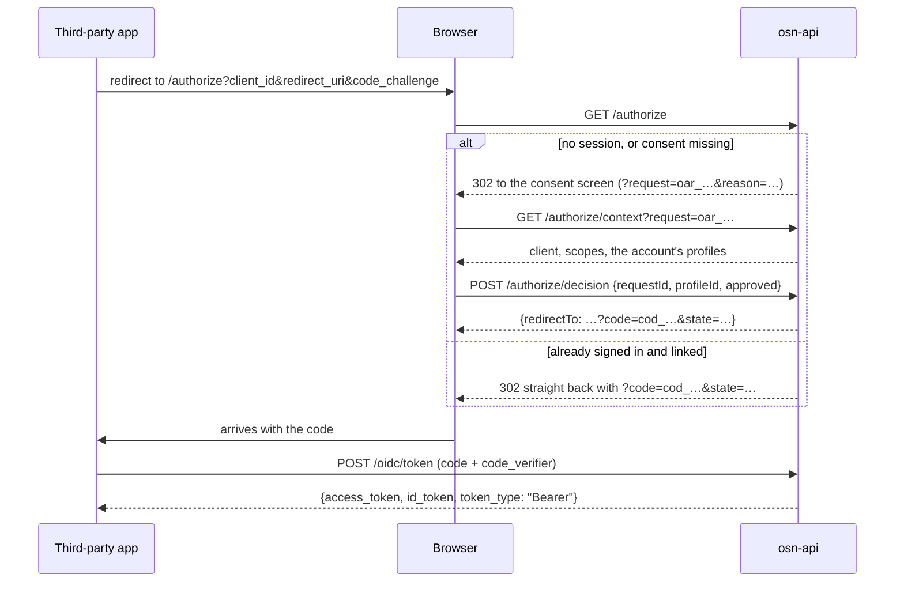

# OIDC provider

`@osn/api` is an OpenID Connect provider. Any app — ours or someone else's — can ask it who the visitor is, get an answer, and never handle a passkey itself.

## Why this exists

A passkey belongs to one domain. The browser stores `SHA-256(rpId)` beside the credential at the moment it is created, and there is no rename. So every product that wants its own sign-in page faces the same fork: share the identity domain, or make the user enrol a second passkey.

The way out is old and boring. Keep the ceremony on the identity domain. Everyone else arrives by redirect and leaves with a token.

That gives four layers, in order of what to reach for first:

| Layer | What it buys | Cost |
|---|---|---|
| **0. OIDC provider** (this page) | Any number of apps, first or third party. Every ceremony runs where the RP ID already matches the origin. | A redirect the user can see |
| **1. First-party session cookie + `prompt=none`** | Silent re-recognition on return visits, no click | Must be a **top-level** redirect. Hidden iframes are dead under Safari ITP and Chrome's third-party cookie work |
| **2. Related Origin Requests** | In-page passkey autofill on another domain, no bounce at all | **Five registrable labels, ever.** See the ceiling below |
| **3. Native `ASWebAuthenticationSession` / Custom Tabs** | Apps share the system browser's cookie jar, so layer 1 works inside a native app | Per-platform wiring |

Layer 0 is the one that scales. Layers 1–3 only remove clicks from it.

### The Related Origin Requests ceiling

WebAuthn L3 §5.11.1: the browser fetches `https://<rpId>/.well-known/webauthn` and reads `{"origins": [...]}`. It counts **registrable labels**, not entries — `a.example.com` and `b.example.com` are one label. Chrome stops at five and silently skips the rest. No error, no console warning; passkeys just stop working on the sixth domain.

So ROR is a small budget for a few marquee domains, not a growth plan. `cireweddings.com` takes one slot. Everything else goes through layer 0.

FedCM is not an option: `IdentityCredential` ships in Chrome only — Safari and Firefox are both `false`.

## The flow

## Endpoints

| Endpoint | Who calls it | Notes |
|---|---|---|
| `GET /authorize` | The browser, top-level | Authorization code flow. No TypeBox query schema — a 422 would break the RFC error contract |
| `GET /authorize/context` | The consent screen | Describes the parked request: client, scopes, the signed-in account's profiles, any existing link. Requires the binding cookie — without it the id reads as unknown (404) |
| `POST /authorize/decision` | The consent screen | Approve or refuse. Returns `{redirectTo}` as JSON, not a 302, so `fetch` does not follow it. Requires the binding cookie; `400 login_required` means "re-authenticate, then retry the same request id" |
| `POST /oidc/token` | The client's server | Code for tokens. Exempt from the origin guard — there is no browser here |
| `GET /oidc/connections` | The account owner (Bearer access token) | The apps this account has authorised: client id/name/logo, linked profile, scope, granted-at |
| `DELETE /oidc/connections/:clientId` | The account owner (Bearer access token) | Withdraws the grant (Art. 7(3)) and deletes any authorization code in flight for the pair — revocation is immediate, not "after the 60 s code window drains". 404 when nothing is live |
| `GET /.well-known/openid-configuration` | Anyone | Discovery |
| `GET /.well-known/jwks.json` | Anyone | The ES256 public key, shared with access tokens |

Everything is `cache-control: no-store`. `GET /authorize` also sends `Referrer-Policy: no-referrer`, so a rendered error page or a bounce off the authorize URL cannot carry the query string — `client_id`, `redirect_uri`, the PKCE challenge — into a third party's referrer log.

## What the rules actually protect

**Errors render before the client is trusted, and only redirect after.** RFC 6749 §4.1.2.1. An unknown `client_id` or an unregistered `redirect_uri` gets a rendered JSON body — 401 and 400 — and no `location` header. Redirecting to a URI the request itself supplied would turn the identity provider into an open redirect, which is the first link in most account-takeover chains. Only once both are known good may an error travel back to the client as `?error=…&state=…`.

**PKCE, S256 only.** No `plain`, no implicit flow, no code without a challenge. A challenge shorter than 43 characters is refused.

**One code, one exchange.** The code table's primary key is `SHA-256(raw code)` and the row is consumed with `DELETE … RETURNING`, so the read and the delete cannot race. Codes live in D1, not the ceremony store, precisely because the store's `get`-then-`delete` can.

**One request id, one decision.** The parked authorization request is deleted whichever way the user decided. A replayed approval cannot mint a second code.

**A profile the account does not own is not a profile.** `completeAuthorization` re-checks ownership before it writes consent.

**Pairwise subjects.** `sub` is `pw_` + base64url of `HMAC-SHA256(salt, sectorIdentifier + "|" + profileId)`. Two clients holding tokens for the same person see two unrelated ids, so they cannot join their records on user id. Derived from the **profile**, not the account — switching profiles gives the client a different subject, which is the point.

**Client authentication is exclusive.** Basic *and* body credentials together is `invalid_request`. A public client presenting any secret is `invalid_client`. A failed Basic attempt gets 401 plus `WWW-Authenticate: Basic realm="oidc"`.

**No refresh tokens, and never an `osn-access` audience.** The token endpoint returns an ID token and a scoped access token bound to the client. It cannot be used to mint a first-party session.

**A parked request belongs to one browser.** When `/authorize` parks a request for the consent UI, the response also sets a per-request HttpOnly cookie (`__Host-osn_oar_…`, 600 s — the request's own TTL) carrying a 256-bit secret whose SHA-256 rides in the parked entry. `/authorize/context` answers a missing or wrong binding exactly like an unknown id, and `/authorize/decision` refuses it **before** consuming the request — so a leaked, forwarded, or guessed `oar_` id can neither be read nor approved anywhere else, and a forged attempt cannot burn the real user's pending flow. (S-M1 oidc.)

**`auth_time` is the session's truth, and freshness demands are enforced.** Codes carry the session row's `created_at` — the moment the user actually authenticated on that device — never the code-mint time. `max_age` is parsed (digits only, ≤10-year ceiling) and an exceeded value behaves exactly like `prompt=login`: the request parks with `requireAuthAfter = now`, and the decision refuses (`400 login_required`, request left alive) any session created before that instant. `max_age` is also re-checked outright at decision time, because a user can sit on the consent screen while their session ages past it. (S-H1 oidc.)

**The exchange re-checks the consent.** `POST /oidc/token` reads the (account, client) consent row after PKCE passes and refuses `invalid_grant` when it is absent or revoked. The revoke route already deletes in-flight codes, but a code inserted concurrently with the revoke can slip past that delete — the exchange-time re-read closes the race by construction, so withdrawal means *now* under every interleaving.

**A re-grant after revocation starts from zero.** Scope merging holds only for live consents (a narrower approval must not shrink an existing grant). Across a revocation boundary the old scope is a withdrawal record: re-approving grants exactly what the consent screen displayed, never the union with the withdrawn scopes.

**Reserved client ids do not exist.** `RESERVED_OIDC_CLIENT_IDS` (`osn-access`, `osn-step-up`, and the ARC S2S audiences) is enforced in `findClient` — a row seeded under such a name reads as absent everywhere at once. The future client-registration route must also reject them at write time (`isReservedOidcClientId`). OIDC access tokens carry a `typ: "at+jwt"` header (RFC 9068), so no verifier can mistake one for an ID token or a first-party token even before checking `aud`. (S-M2 oidc.)

## `prompt` handling

| Value | Signed out | Signed in |
|---|---|---|
| absent | interaction, `reason=login` | code if consent is on record, else `reason=consent` |
| `none` | `error=login_required` | code if linked, else `error=consent_required` |
| `login` | interaction | interaction |
| `select_account` | interaction | interaction, even for a first-party client |
| `consent` | interaction | interaction |

`none` combined with any other value is `invalid_request`, per the spec.

`max_age` composes with the table above: a session older than `max_age` seconds is treated as "signed out" for freshness purposes — interaction with `reason=login` normally, `error=login_required` under `prompt=none`.

First-party clients skip the consent screen — the link is recorded for the default profile and a code comes straight back — unless `prompt` asks otherwise.

## Data

Three tables in `@osn/db` (migration `0002_wet_gamora`):

- `oauth_clients` — the registry. `redirect_uris` is a JSON array; exact match, no wildcards. `sector_identifier` feeds the pairwise subject. `client_secret_hash` is null for public clients. There is no write route yet; rows are seeded by hand.
- `oauth_authorization_codes` — id is the hash of the code. 60-second TTL. A redeemed code is deleted on the spot; an abandoned one is left behind, so `runExpiredAuthCodeSweep` (a `DELETE … WHERE expires_at <= now`, riding `oauth_codes_expires_idx`) runs from the Worker's `scheduled` handler alongside the session and deletion sweeps. Nothing reads an expired code — the sweep only keeps the table from growing without bound.
- `oauth_consents` — one row per (account, client), holding the linked profile and the granted scope. Scope **merges** on re-consent, never replaces. The write is insert-first (`INSERT … ON CONFLICT DO NOTHING`, then merge only on conflict). Revoking (`DELETE /oidc/connections/:clientId`) stamps `revoked_at`, deletes the pair's in-flight codes, and the row is kept as the withdrawal record until account erasure purges it.

`code_challenge_method` has no column. S256 is the only value the provider accepts, so storing it would only record a constant.

## Rate limits

Six per-IP limiters: `oidc_authorize` (20/min), `oidc_authorize_context` (30/min), `oidc_authorize_decision` (10/min), `oidc_token` (60/min), `oidc_connections_list` (30/min), `oidc_connections_revoke` (10/min). See [[rate-limiting]].

## Configuration

| Variable | Required | What happens without it |
|---|---|---|
| `OSN_PAIRWISE_SALT` | **Yes, outside local** | osn-api refuses to boot. The check is fail closed and wants 32 bytes or more |
| `OSN_AUTHORIZE_UI_URL` | No | Falls back to `/authorize` on the web origin |
| `OSN_ISSUER_URL` | Yes | Already required; it is the `iss` claim and the discovery issuer |

The salt must never change once tokens are live — every pairwise subject would change with it, and every client would see its users as strangers. Treat it as permanent.

The issuer string is an identifier, not branding. Moving the provider to a prettier domain later costs nothing as long as `iss` and the RP ID stay put.

## Not built yet

- **`/userinfo`** — the ID token carries what clients need for now.
- **`offline_access`** — third parties get no refresh token, so a long-lived integration must send the user through `/authorize` again.
- **The consent screen itself** — the endpoints behind it exist (context, decision, and now connections); the page does not. Contract for whoever builds it: the browser already holds the per-request binding cookie (the flow only works in the browser that hit `/authorize`), and a `400 login_required` from the decision means "drive a fresh sign-in, then retry the SAME request id".
- **A client-registration route** — rows go in by hand. Must reject `RESERVED_OIDC_CLIENT_IDS` at write time (lookup already refuses them) and pin `logo_url` to `https:` — the value flows into the first-party connections/consent UI as an image `src`, so an unvalidated scheme is a stored-XSS-adjacent surface.
- **The apex worker** serving `/.well-known/webauthn`, `apple-app-site-association` and `assetlinks.json`. Blocked on the identity domain being bought. That is layers 2 and 3; layer 0 works without it.
