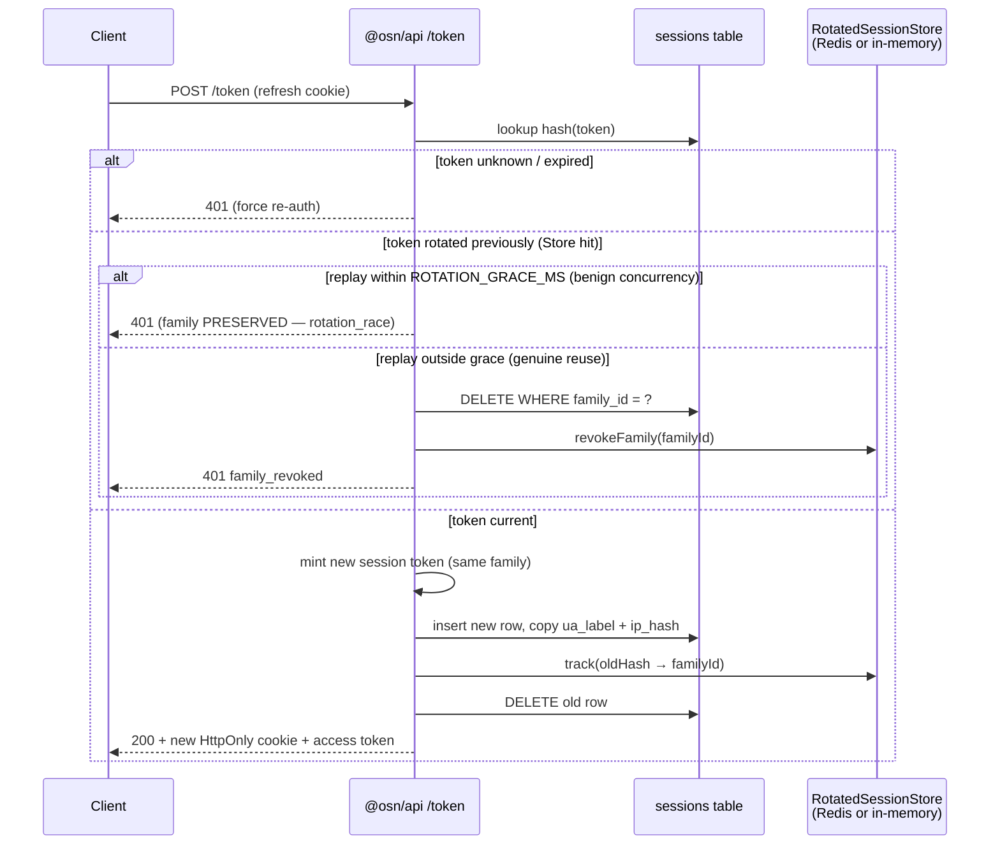

# Session introspection + revocation

Per-device session management, exposed to users in Settings. Builds on the server-side session store introduced in Copenhagen Book C1/C2/C3.

## Refresh-token rotation chain (C2)

Per-account hard cap: `MAX_SESSIONS_PER_ACCOUNT = 50`. `issueTokens` LRU-evicts the oldest rows once the cap is reached so an attacker can't inflate the revocation surface. The public revocation handle (first 16 hex of the SHA-256) is collision-safe inside that bounded population.

## Endpoints

| Route | Purpose |
|---|---|
| `GET /sessions` | List the caller's active sessions with coarse UA labels + timestamps, flagging the current one |
| `DELETE /sessions/:id` | Revoke a session by its 16-hex public handle (first 16 chars of SHA-256 hash) |
| `POST /sessions/revoke-all-other` | Revoke every session EXCEPT the caller's current one |

All endpoints authenticate via `Authorization: Bearer <access_token>` and resolve `accountId` server-side. A session handle from account A's log cannot be replayed to revoke a session in account B — the DELETE is scoped to the caller's own account.

### Cross-device login

QR-code mediated session transfer — authenticate on a new device by scanning a code from an already-authenticated device.

| Route | Auth | Purpose |
|---|---|---|
| `POST /login/cross-device/begin` | None | Create a pending request; returns `requestId` + `cdlSecret` |
| `POST /login/cross-device/:requestId/status` | None | Poll for approval; returns session tokens once on approval |
| `POST /login/cross-device/:requestId/approve` | Bearer | Device A approves; issues session for device B |
| `POST /login/cross-device/:requestId/reject` | Bearer | Device A explicitly rejects |

**Protocol:** Device B calls `begin`, renders a QR code encoding the `requestId` + `cdlSecret`, and polls `status` at ~2s intervals. Device A scans the QR, calls `approve` with its access token + the secret from the QR fragment. The server issues a session for device B and records a `cross_device_login` security event + email notification.

**Security properties:** 256-bit CSPRNG secret, SHA-256 hashed at rest, constant-time comparison, one-time session consumption, 5-minute TTL, rate-limited on all endpoints. The secret never appears in URL query strings (all endpoints use POST bodies). In-memory store with FIFO eviction at 1000 entries — Redis migration deferred to Phase 4.

## Metadata captured at issue time

Added to the `sessions` table in migration `0005_sessions_metadata_and_email_change.sql`:

| Column | What it stores | Source |
|---|---|---|
| `ua_label` | Coarse `"Firefox on macOS"` label | `deriveUaLabel(headers["user-agent"])` — bounded cardinality |
| `ip_hash` | `HMAC-SHA256(sessionIpPepper, ip)` | `getClientIp()` + peppered HMAC |
| `last_used_at` | Unix seconds | Updated on every successful refresh/verify |

**Why HMAC-peppered, not raw SHA-256 for IPs?** Plain SHA-256 over the v4 address space (2^32) is trivially rainbow-tableable. A server-side secret pepper makes offline correlation impossible without pepper access. Pepper rotation is cheap — only display continuity is affected, not session validity.

**Configuration:** `OSN_SESSION_IP_PEPPER` (≥32 bytes). Startup fails in non-local environments if unset — silent IP-hash degradation would cost users a security signal without anyone noticing.

## Public revocation handle

The public `id` field is the first 16 hex chars of the session-token SHA-256. Chosen over exposing the full hash because:

- **64 bits of collision resistance** is more than enough inside a single account's handful of sessions.
- A full SHA-256 accidentally logged gives an attacker a forge-able DELETE URL. A 16-hex prefix does not.

The server re-scans its sessions table by accountId and finds the row whose hash prefix matches. This maps handle → internal hash at request time.

## Rotation preserves metadata

Refresh-token rotation (Copenhagen Book C2) deletes the old session row and inserts a new one with a rotated session token. We copy the old row's `ua_label` and `ip_hash` onto the new row so Settings continues to show the same "Firefox on macOS" entry instead of flipping to a new device. The `last_used_at` timestamp is set to the rotation moment.

## Rotation grace window (concurrency tolerance)

Rotation is single-use, but legitimate clients produce concurrent or retried grants of the **same current token**: two browser tabs bootstrapping on reload, a cold-start bootstrap racing a 401-refresh in one tab, or a grant retried after a lost response. Treating every such replay as C2 reuse revoked the whole family and logged the user out across every device — the "logs out sometimes" bug. Two guards now distinguish benign concurrency from genuine reuse, WITHOUT weakening detection of a real replay:

- **CAS-0-rows is always benign.** In the rotation swap the old-session `DELETE` is a compare-and-swap; a 0-rows result means the row was present at verify but gone by delete — i.e. a concurrent grant rotated it in the gap. A replay of an *already*-rotated token can't reach here (it fails `verifyRefreshToken`, whose row is absent, and goes down `detectReuse`). So a 0-rows CAS is never reuse: the losing grant fails but the family is **preserved** (no `revokeFamily`, no `reuse_detected`; a `rotation_race` metric fires instead).
- **`detectReuse` grace window.** When a rotated-out hash is replayed, `detectReuse` compares `now − rotatedAtMs` against `ROTATION_GRACE_MS` (10 s). Within the window it is benign concurrency/retry → family preserved (`rotation_race`). Outside it → genuine reuse → full family revocation (unchanged). The window is short: an attacker replaying a stolen rotated token seconds after the legitimate rotation gains nothing they couldn't do with the live token, and any replay after the window still revokes. Mirrors the "reuse leeway" interval standard in rotating-refresh-token implementations.

The client complements this with a shared single-flight (`osn/client`): the bootstrap and refresh paths dedupe the `/token` grant against each other so a bootstrap racing a refresh in one tab fires `/token` once. Cross-*tab* coordination (a Web Locks guard) is a possible follow-up; the server grace already prevents cross-tab races from revoking the family.

## Cluster-safe reuse detection (S-H1 session)

The C2 reuse detector needs to remember, for up to `refreshTokenTtl` (30 days), which session hashes have been rotated out. Originally this lived as an in-process `Map<hash, { familyId, rotatedAt }>` inside `createAuthService` — correct for single-process dev but silently partitioned in multi-pod deployments: a rotation recorded on pod A was invisible to pod B, so replays hitting B passed without triggering family revocation.

The `RotatedSessionStore` abstraction (`osn/api/src/lib/rotated-session-store.ts`) replaces that map. `createInMemoryRotatedSessionStore()` preserves the FIFO-swept, `ROTATED_SESSIONS_MAX = 100_000`-bounded in-process behaviour for tests and single-process dev. `createRedisRotatedSessionStore(client)` backs the state on Redis using one key family:

- `osn:rot-session:hash:{sessionHash}` → `{familyId}:{rotatedAtMs}`, PX = `refreshTokenTtl * 1000` — the authoritative lookup used by `check`. `check` returns `{ familyId, rotatedAtMs }` (a `RotatedHashRecord`); the rotation timestamp drives the grace-window classification below. A legacy value with no numeric suffix parses to `rotatedAtMs 0` (rotated "long ago" → treated as genuine reuse — the strict default).

Redis's native per-key PX expiry handles cleanup, so `track` is a single round-trip (no family-set write, no JSON blob, no cross-command race). `revokeFamily` is a deliberate no-op on the Redis backend — the DB-level `DELETE FROM sessions WHERE family_id = ?` in `detectReuse` is the authoritative revocation. A stale `hash:*` key that lingers until TTL only means a later replay fires another idempotent DB delete plus another `reuse_detected` metric increment. That is a more useful observability signal than silently deduping the attempt.

Failure modes fail **open**: `check` returns `null` on Redis error (so an outage cannot manufacture false-positive family revocations that log legitimate users out), and `track` logs a warning and continues (the DB-level rotation has already committed). The trade-off is a temporary weakening of reuse detection during a Redis outage, not a loss of session security — the DB row lookup in `verifyRefreshToken` is still authoritative for rejecting unknown tokens. The store wraps the `onError` callback from `index.ts` in its own try/swallow, so a misconfigured observability layer cannot cascade into a rejected store operation. `sanitizeCause` strips any embedded credentialed URLs from ioredis connection error strings before they are annotated.

`AuthConfig.rotatedSessionStore` is the injection point. Non-local deploys pass the Redis-backed store from `osn/api/src/index.ts`; tests and the in-memory fallback path omit it.

## Observability

- `osn.auth.session.operations{action, result}` — one per `list` / `revoke` / `revoke_all` call
- Spans: `auth.session.list`, `auth.session.revoke`, `auth.session.revoke_all`
- `SecurityInvalidationTrigger` union extended with `session_revoke`, `session_revoke_all`, and `passkey_delete` so the H1 dashboard picks up user-initiated revocations alongside passkey-register, passkey-delete, recovery-code, and email-change triggers
- `osn.auth.session.rotated_store.operations{action, result, backend}` — counter for every rotated-session store call. `action` ∈ `track` / `check` / `revoke_family`; `result` ∈ `ok` / `hit` / `miss` / `error`; `backend` ∈ `memory` / `redis`. Error rate by backend is the primary Redis-health signal for the reuse detector.
- `osn.auth.session.reuse_detected` / `osn.auth.session.family_revoked` — genuine C2 reuse caught (replay outside the grace window) and the resulting whole-family revocations. A spike is a real security signal (token theft) — distinct from the benign metric below.
- `osn.auth.session.rotation_race` — benign concurrent/retried grants tolerated within `ROTATION_GRACE_MS` (CAS-0-rows or a rotated-token replay inside the window). The family is PRESERVED. Expected to be non-zero for normal multi-tab usage; it is NOT a security signal. Watch the ratio of `family_revoked` to `rotation_race` — a rise in the former relative to the latter is what matters.
- `osn.auth.session.rotated_store.duration{action, backend}` — histogram of store operation latency
- Spans: `auth.session.rotated_store.track`, `auth.session.rotated_store.check`, `auth.session.rotated_store.revoke_family`, wrapped by the outer `auth.session.reuse_detect` and `auth.session.rotate` spans
- Redaction: `ipHash`, `uaLabel` (both spellings), `familyId` (already in the deny-list — correlates sessions across rotation events)

## UI

- `@osn/ui/auth/SessionsView` — Settings panel. "This device" badge on current, Revoke button disabled for current, "Sign out everywhere else" with a synchronous `confirm()` (toast-style undo would leave the stolen-session window open).

**Device / passkey management (#155).** The companion `@osn/ui/auth/PasskeysView` surfaces the *credential* side of device management — list / add / rename / remove passkeys, each destructive operation step-up-gated. It mounts in `@osn/social`'s Settings Security section and, as of #155, in the cire organiser portal's `SecurityPanel`. Because the deployed osn-api runs with email degraded ([[email]]), cire mounts it with `StepUpDialog`'s `passkeyOnly` flag so the OTP step-up factor is suppressed (an OTP that can't be mailed would dead-end the ceremony). New-device help (a backed-up/synced passkey, the cross-device QR ceremony above, or a recovery code) is covered on [[passkey-primary]].

## Threat model

Gives the user a fast lever to react to:

- Lost / stolen device → `Revoke` that specific session.
- Suspected compromise → `Sign out everywhere else` from a known-good device.
- Routine hygiene → surface all devices currently holding a valid cookie.

With 5-min access tokens and rotation-on-refresh, the attacker's window after revocation is under 5 minutes.
